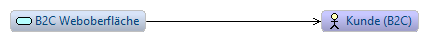
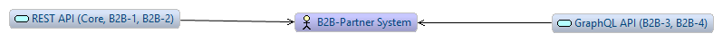
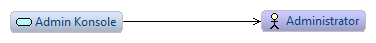
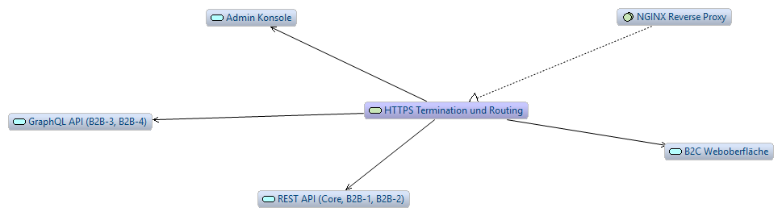
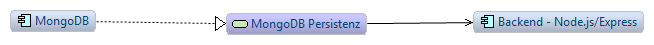
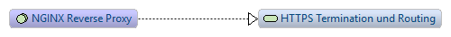

## Systemarchitektur (marktverbund25.at)

Unser System ist als containerisierte 3‑Schichten Architektur umgesetzt (UI → API/Backend → DB) und wird zentral über einen NGINX Reverse Proxy bereitgestellt. MongoDB wird als persistente Datenbasis verwendet.

**Komponenten**

* **Frontend (React + Vite)**

  * B2C‑Weboberfläche (Kundeninteraktion)
  * Admin‑Konsole
  * kommuniziert ausschließlich über relative Pfade (`/api/*`, `/graphql`), gleiche Origin, dadurch wirken wir etwaigen Mixed‑Content‑Problemen entgegen
* **Backend (Node.js + Express + Mongoose)**

  * REST‑API für Core‑Funktionen und B2B‑Usecases (B2B‑1, B2B‑2)
  * GraphQL‑API für zusätzliche B2B‑Usecases (B2B‑3, B2B‑4) und Abfrage-/Änderungsanforderungen
  * Persistenzzugriff über Mongoose auf MongoDB
* **Datenbank (MongoDB)**

  * zentrales Speicherung von Users, Products, Offers, Orders, Limits sowie Batch-/Report‑Artefakten
* **Reverse Proxy (NGINX)**

  * terminierte **TLS/HTTPS** Verbindung
  * Routing:

    * `/` → React UI
    * `/api/*` → Express REST
    * `/graphql` → Express GraphQL

**B2B‑Schnittstellen im System**

* **B2B‑1 & B2B‑2 (REST Kuttnig):** Limit Order platzieren und stornieren.
* **B2B‑3 & B2B‑4 (GraphQL Kimeswenger):** Offer Sync Batch und Sales Report Export als asynchrone Prozesse mit Status-/Result‑Abfragen.

B2B-3 & B2B-4 wurden im Zuge dieser Abgabe neu hinzugefügt.
Details siehe: (link)

**Archimate visualisierung:**













---

## Adminschnittstelle

Die Admin‑Weboberfläche ist eine interaktive Administrationsoberfläche, um einige Demo und Systemdaten zu verwalten. 

Funktionen:

* Admin Login via `Admin Key` (Header‑basierte Absicherung der Admin‑Endpoints)
* Dashboard/Overview (Users/Products/Offers/Orders/Limits)
* Verwaltung von **Users** (anlegen/löschen, Business‑Flag setzen)
* Verwaltung von **Products/Categories/Offers** (anlegen/löschen, Offers zu Produkten hinzufügen/entfernen)

---

## NGINX & SSL Support

Wir nutzen **NGINX als Reverse Proxy** für die gesamte Plattform.

* NGINX terminiert **HTTPS (TLS)** über ein self‑signed Zertifikat und leitet Requests intern weiter.
* Dadurch sind Frontend + REST + GraphQL konsistent über HTTPS erreichbar.

## Setup

Build:
```
docker compose build
```

Run:
```
docker compose up
```

Monitor logs of specific container:

```
docker compose logs -f [SERVICE]
```
